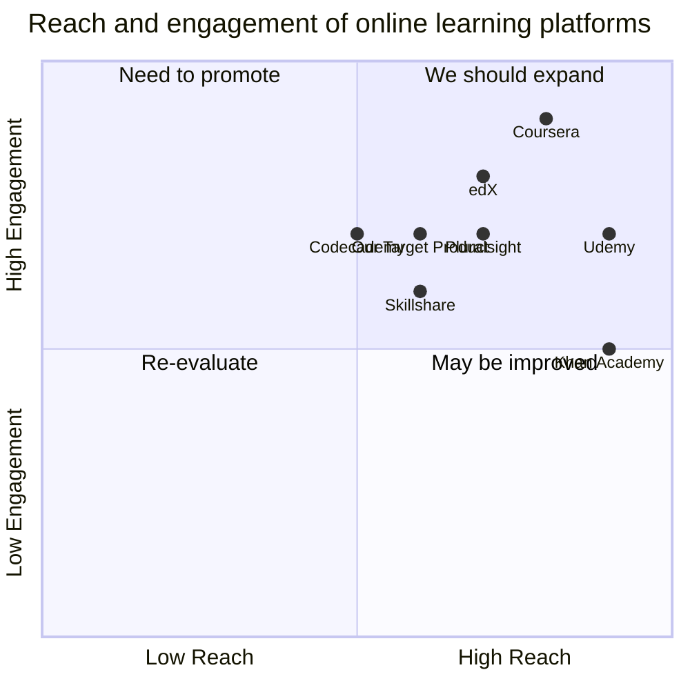

## Original Requirements:

The boss wants a Course Review webapp similar to IMDB for movies.

## Product Goals:
```python
[
    "Create a Course Review webapp",
    "Provide a platform for users to review and rate courses",
    "Allow users to search and discover courses based on ratings and reviews"
]
```

## User Stories:
```python
[
    "As a user, I want to be able to create an account and log in",
    "As a user, I want to be able to search for courses and read reviews",
    "As a user, I want to be able to leave a review and rate a course",
    "As a user, I want to be able to see the average rating and reviews for a course",
    "As a user, I want to be able to filter and sort courses based on ratings and reviews"
]
```

## Competitive Analysis:
```python
[
    "Coursera: A popular online learning platform that offers a wide range of courses",
    "Udemy: An online learning platform that allows instructors to create and sell courses",
    "edX: A nonprofit online learning platform that offers courses from top universities",
    "Skillshare: An online learning community with thousands of classes in design, business, and more",
    "Khan Academy: A nonprofit organization that provides free educational resources and courses",
    "Codecademy: An online learning platform focused on coding and programming courses",
    "Pluralsight: An online learning platform with a focus on technology and professional development courses"
]
```

## Competitive Quadrant Chart:


## Requirement Analysis:
The product should be a web application that allows users to review and rate courses. Users should be able to create an account, log in, search for courses, read reviews, leave reviews, rate courses, and filter/sort courses based on ratings and reviews.

## Requirement Pool:
```python
[
    ("User authentication and account creation", "P0"),
    ("Course search functionality", "P0"),
    ("Course review and rating functionality", "P0"),
    ("Average rating and review display for courses", "P1"),
    ("Course filtering and sorting based on ratings and reviews", "P1")
]
```

## UI Design draft:
The web app should have a clean and intuitive user interface. It should include a search bar at the top for users to search for courses. Below the search bar, there should be a list of courses with their average ratings and reviews displayed. Users should be able to click on a course to view more details and read individual reviews. There should be a button or link to leave a review and rate the course. Users should also be able to filter and sort the courses based on ratings and reviews. The overall design should be modern and visually appealing.

## Anything UNCLEAR:
There are no unclear points.