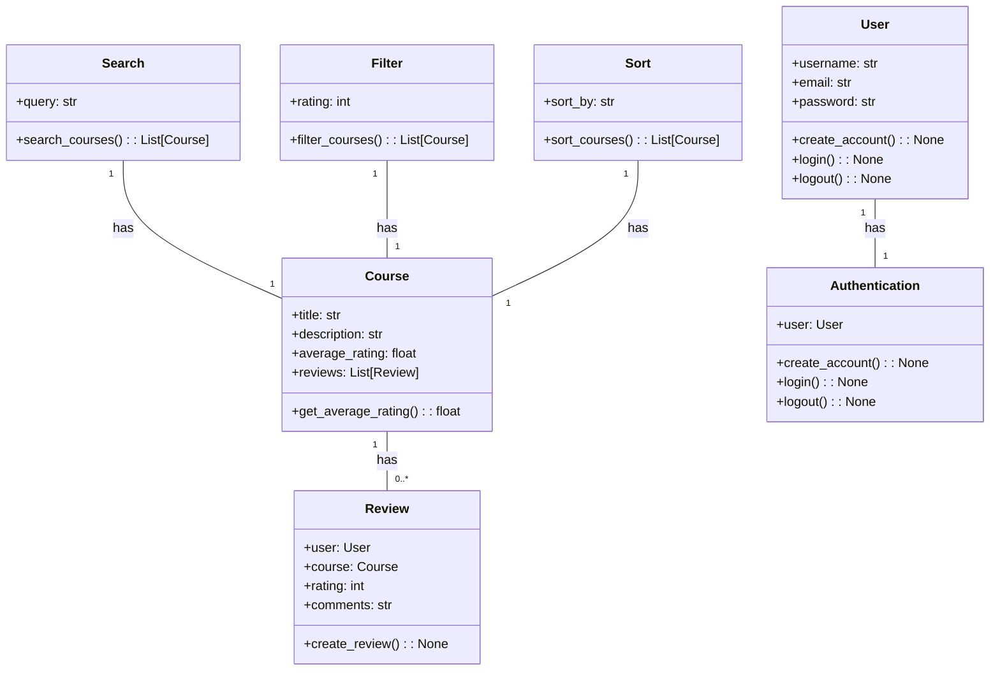
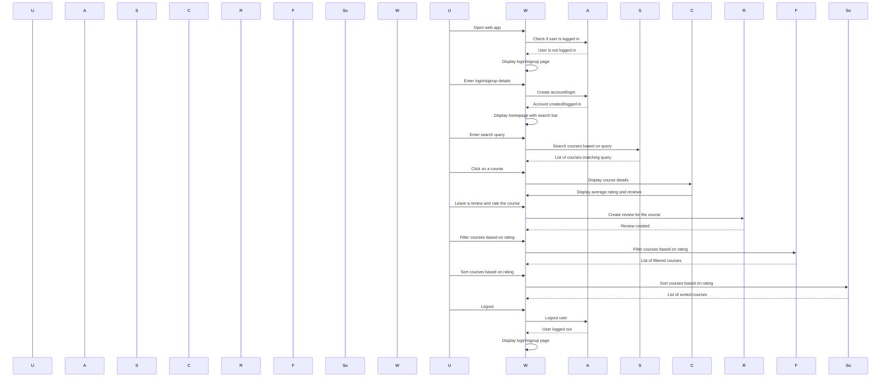

## Implementation approach:
For the implementation of the Course Review webapp, we will use the Django web framework, which is a high-level Python web framework that follows the model-view-controller (MVC) architectural pattern. Django provides a robust set of tools and features for building web applications, including user authentication, database management, and URL routing.

To handle user authentication and account creation, we will use Django's built-in authentication system. This will allow users to create an account, log in, and manage their profile information.

For the course search functionality, we will use Django's database querying capabilities to search for courses based on user input. We will also implement a search bar in the user interface to allow users to easily search for courses.

To implement the course review and rating functionality, we will create a Course model that will store information about each course, including its title, description, and average rating. We will also create a Review model that will store user reviews for each course, including the user's rating and comments. Users will be able to leave a review and rate a course through a form in the user interface.

To display the average rating and reviews for a course, we will calculate the average rating based on the reviews stored in the database and display it on the course details page. We will also display a list of individual reviews for the course.

For the course filtering and sorting functionality, we will provide options for users to filter and sort courses based on ratings and reviews. This can be done through dropdown menus or checkboxes in the user interface.

Overall, the implementation approach will involve creating Django models for courses and reviews, implementing user authentication and account creation, implementing search functionality, and providing options for users to leave reviews, rate courses, and filter/sort courses based on ratings and reviews.

## Python package name:
```python
"course_review_webapp"
```

## File list:
```python
[
    "main.py",
    "models.py",
    "views.py",
    "urls.py",
    "templates/index.html",
    "templates/course_details.html",
    "templates/login.html",
    "templates/signup.html",
    "static/css/style.css",
    "static/js/script.js"
]
```

## Data structures and interface definitions:


## Program call flow:


## Anything UNCLEAR:
The requirements are clear and there are no unclear points.