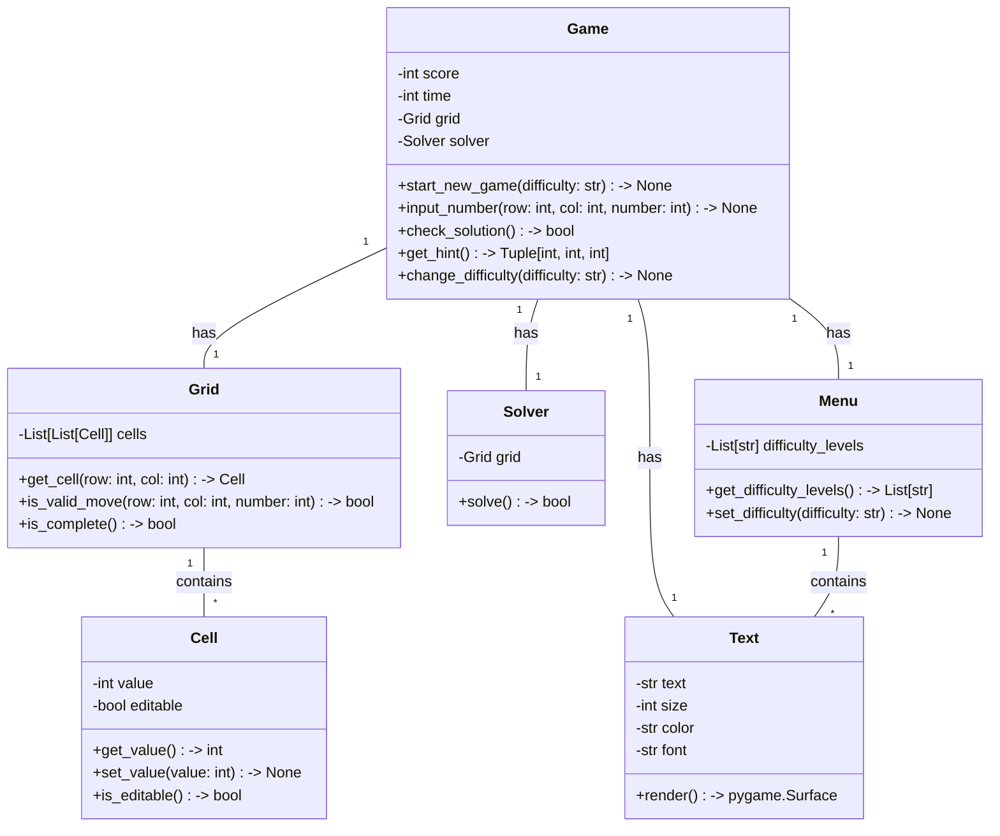

## Implementation approach
For implementing the sudoku game using pygame, we will use the following open-source tools:

1. Pygame: A popular open-source library for creating games and multimedia applications in Python. It provides functionality for creating windows, handling user input, and rendering graphics.

2. Pygame_gui: An open-source GUI library for pygame that provides a set of pre-built UI elements and tools for creating user interfaces. It will help us create the user-friendly interface for the sudoku game.

3. Pygame-menu: Another open-source library for pygame that provides a menu system for creating menus and submenus in pygame applications. We can use it to create menus for starting a new game, changing difficulty levels, and other options.

4. Pygame-Menu-Selection: An open-source library that extends pygame-menu and provides additional features such as selection menus, checkboxes, and sliders. It can be used to enhance the user interface and provide more interactive options.

5. Pygame-Text: An open-source library for pygame that provides text rendering functionality. We can use it to display text elements such as hints, messages, and scores in the game.

By using these open-source tools, we can leverage the existing functionality and resources available in the community to build a robust and feature-rich sudoku game.

## Python package name
```python
"sudoku_game"
```

## File list
```python
[
    "main.py",
    "game.py",
    "grid.py",
    "cell.py",
    "solver.py",
    "menu.py",
    "text.py",
    "assets/",
    "fonts/",
    "images/"
]
```

## Data structures and interface definitions


## Program call flow
```mermaid
sequenceDiagram
    participant M as Main
    participant G as Game
    participant GD as Grid
    participant C as Cell
    participant S as Solver
    participant MN as Menu
    participant T as Text
    ...
    M->>G: start new game
    G->>MN: get difficulty levels
    MN->>M: return difficulty levels
    M->>G: set difficulty
    G->>GD: create grid
    GD->>C: create cells
    G->>S: create solver
    M->>G: input number
    G->>GD: get cell
    GD->>C: set value
    M->>G: check solution
    G->>GD: is complete
    GD->>C: get value
    M->>G: get hint
    G->>S: solve
    S->>GD: get cell
    GD->>C: get value
    M->>G: change difficulty
    G->>MN: set difficulty
    M->>G: end game
```

## Anything UNCLEAR
The requirements are clear to me.