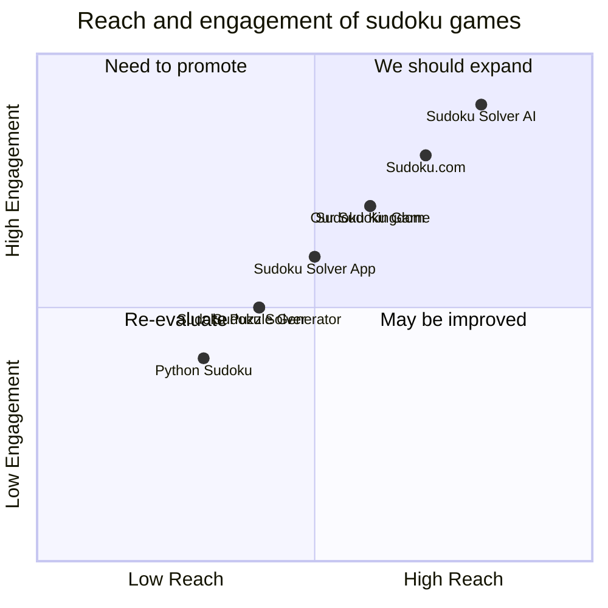

## Original Requirements
The boss wants me to create a sudoku game using pygame.

## Product Goals
```python
[
    "Create a sudoku game using pygame",
    "Provide a user-friendly interface",
    "Implement various difficulty levels"
]
```

## User Stories
```python
[
    "As a user, I want to be able to start a new game",
    "As a user, I want to be able to input numbers into the grid",
    "As a user, I want to be able to check if my solution is correct",
    "As a user, I want to be able to get hints when I'm stuck",
    "As a user, I want to be able to change the difficulty level"
]
```

## Competitive Analysis
```python
[
    "Python Sudoku: A simple sudoku game implemented in Python",
    "Sudoku Solver: A program that can solve any sudoku puzzle",
    "Sudoku Kingdom: A collection of sudoku puzzles with different difficulty levels",
    "Sudoku.com: An online sudoku game with a user-friendly interface",
    "Sudoku Solver App: A mobile app that can solve sudoku puzzles",
    "Sudoku Solver AI: An AI-powered sudoku solver",
    "Sudoku Puzzle Generator: A program that can generate sudoku puzzles"
]
```

## Competitive Quadrant Chart


## Requirement Analysis
The product should be a sudoku game implemented using pygame. It should have a user-friendly interface and provide various difficulty levels for the puzzles. Users should be able to start a new game, input numbers into the grid, check if their solution is correct, get hints when they're stuck, and change the difficulty level.

## Requirement Pool
```python
[
    ("End game screen with score and time", "P0"),
    ("Ability to save and load game progress", "P1"),
    ("Option to highlight incorrect numbers", "P1"),
    ("Timer to track the time taken to solve the puzzle", "P2"),
    ("Option to undo and redo moves", "P2")
]
```

## UI Design draft
The UI should have a grid layout to display the sudoku puzzle. Each cell in the grid should be clickable to allow the user to input numbers. The UI should also have buttons for starting a new game, checking the solution, getting hints, and changing the difficulty level. The design should be clean and minimalistic, with a soothing color scheme.

## Anything UNCLEAR
There are no unclear points.