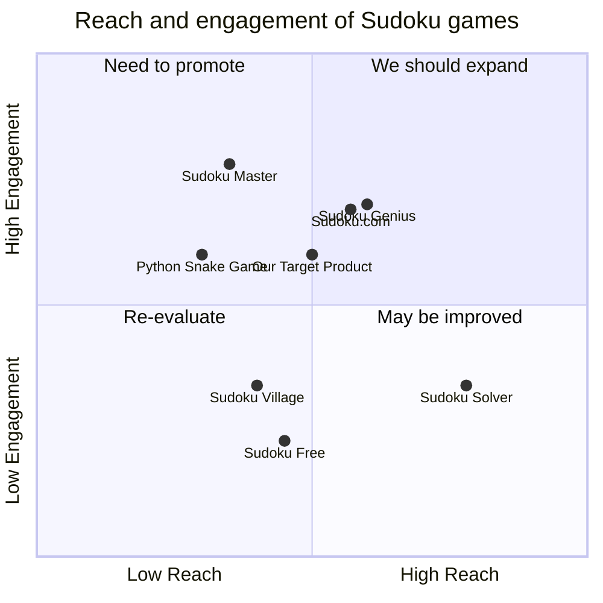

## Original Requirements:
The boss wants me to create a Sudoku game using pygame.

## Product Goals:
- Create a Sudoku game that is enjoyable and challenging for players.
- Provide a user-friendly interface that is easy to navigate and interact with.
- Implement various difficulty levels to cater to different skill levels of players.

## User Stories:
- As a player, I want to be able to start a new game and choose the difficulty level.
- As a player, I want to be able to input numbers into the Sudoku grid and receive feedback on whether it is correct or not.
- As a player, I want to be able to pause the game and resume it later.
- As a player, I want to be able to receive hints or suggestions when I am stuck.
- As a player, I want to be able to check my progress and see how many cells I have filled correctly.

## Competitive Analysis:
- Python Snake Game: A popular game where players control a snake to eat food and grow longer while avoiding collisions with walls and the snake's own body.
- Sudoku Free: A mobile app that offers a wide range of Sudoku puzzles with different difficulty levels and features such as hints and auto-fill options.
- Sudoku.com: A website that provides Sudoku puzzles for free, with options to play online or print them out.
- Sudoku Solver: A software that solves Sudoku puzzles automatically, providing step-by-step solutions.
- Sudoku Village: A multiplayer online Sudoku game where players can compete against each other in real-time.
- Sudoku Master: A mobile app that offers a variety of Sudoku puzzles and features, such as a timer and statistics tracking.
- Sudoku Genius: A puzzle-solving app that provides Sudoku puzzles with different difficulty levels and offers hints and solution options.

## Competitive Quadrant Chart:


## Requirement Analysis:
The product should be a Sudoku game implemented using the pygame library. It should have a user-friendly interface that allows players to start a new game, choose the difficulty level, input numbers into the Sudoku grid, receive feedback on correctness, pause and resume the game, receive hints or suggestions, and check their progress. The game should also provide various difficulty levels to cater to different skill levels of players.

## Requirement Pool:
```python
[
    ("Implement the Sudoku grid and user interface", "P0"),
    ("Allow players to start a new game and choose the difficulty level", "P0"),
    ("Implement input functionality for players to fill numbers into the grid", "P0"),
    ("Provide feedback on the correctness of the filled numbers", "P0"),
    ("Implement pause and resume functionality", "P1")
]
```

## UI Design draft:
The UI design should include the following elements and functions:
- Sudoku grid: A 9x9 grid where players can input numbers.
- Difficulty selection: A dropdown menu or buttons to allow players to choose the difficulty level.
- New game button: A button to start a new game.
- Pause button: A button to pause the game.
- Resume button: A button to resume the game.
- Hint button: A button to provide hints or suggestions to the player.
- Check button: A button to check the correctness of the filled numbers.
- Progress display: A display to show the number of correctly filled cells.

The style of the UI should be clean and minimalistic, with easy-to-read numbers and clear buttons. The layout should be intuitive and organized, with the Sudoku grid taking the central focus and the other elements placed around it for easy access.

## Anything UNCLEAR:
There are no unclear points.