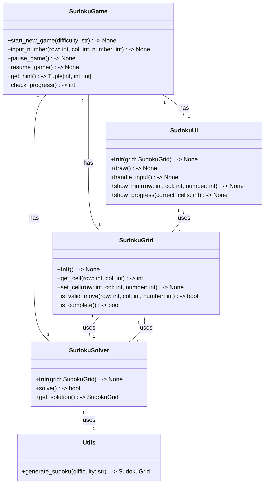
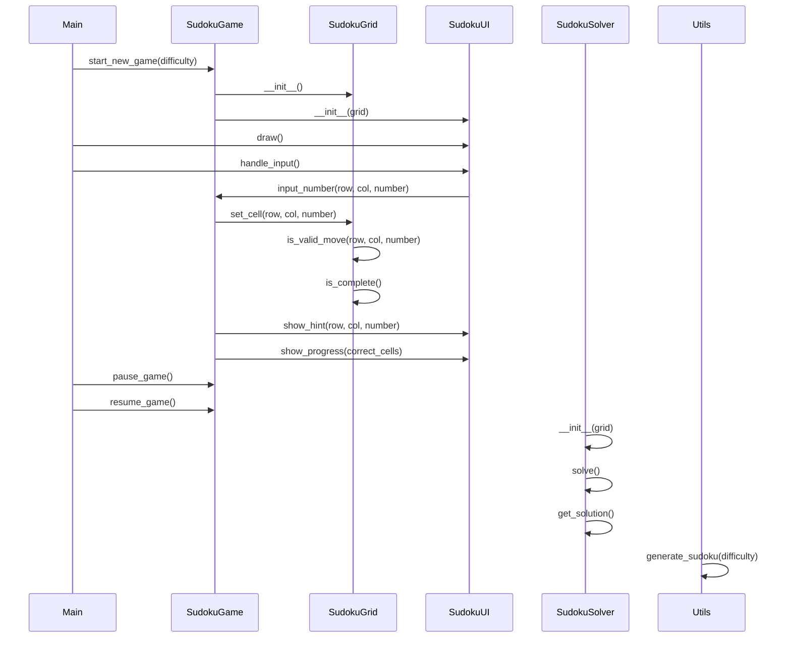

## Implementation approach:
We will use the pygame library to implement the Sudoku game. Pygame is a popular open-source library for game development in Python, providing functionality for graphics, sound, and user input. It is widely used and has a large community, making it a good choice for our project. We will also make use of other open-source tools and libraries to enhance the functionality and usability of the game.

## Python package name:
```python
"sudoku_game"
```

## File list:
```python
[
    "main.py",
    "sudoku.py",
    "grid.py",
    "ui.py",
    "solver.py",
    "utils.py"
]
```

## Data structures and interface definitions:


## Program call flow:


## Anything UNCLEAR:
The requirements are clear to me.