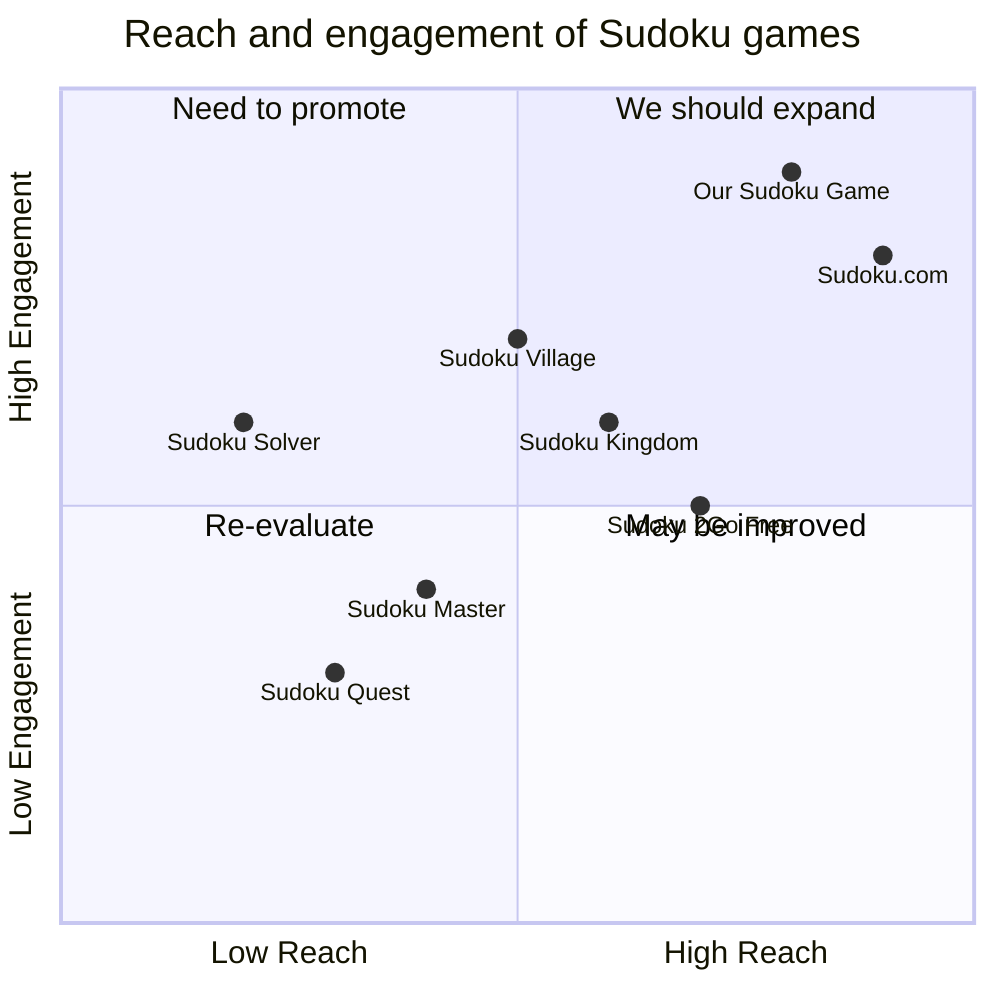

## Original Requirements:
The boss wants me to create a Sudoku game using pygame.

## Product Goals:
- Create a Sudoku game that is enjoyable and challenging for players.
- Provide a user-friendly interface with intuitive controls.
- Implement various difficulty levels to cater to different skill levels.

## User Stories:
- As a player, I want to be able to start a new game with a click of a button.
- As a player, I want to be able to input numbers into the Sudoku grid easily.
- As a player, I want to be able to check my progress and get hints if I'm stuck.
- As a player, I want to be able to save and load my game progress.
- As a player, I want to be able to change the difficulty level of the game.

## Competitive Analysis:
- Sudoku.com: A popular Sudoku game with a clean and user-friendly interface.
- Sudoku Solver: An app that solves Sudoku puzzles step by step.
- Sudoku Village: A Sudoku game with various themes and daily challenges.
- Sudoku 2Go Free: A mobile app that offers thousands of Sudoku puzzles.
- Sudoku Kingdom: A website that provides Sudoku puzzles of different difficulty levels.
- Sudoku Master: A Sudoku game with a timer and leaderboard.
- Sudoku Quest: A Sudoku game with a story mode and power-ups.

## Competitive Quadrant Chart:


## Requirement Analysis:
The product should be a Sudoku game that allows players to play and solve Sudoku puzzles. It should have a user-friendly interface with intuitive controls. The game should provide various difficulty levels and allow players to save and load their progress. Additionally, the game should have a hint feature to assist players when they are stuck.

## Requirement Pool:
```python
[
    ("Implement a new game button", "P0"),
    ("Allow players to input numbers into the Sudoku grid", "P0"),
    ("Implement a progress check feature", "P1"),
    ("Implement a hint feature", "P1"),
    ("Allow players to save and load game progress", "P2")
]
```

## UI Design draft:
The Sudoku game will have a clean and minimalistic design. The main screen will display the Sudoku grid with empty cells for players to fill in. There will be a toolbar at the top with buttons for starting a new game, checking progress, getting hints, and saving/loading game progress. The difficulty level can be selected from a dropdown menu. The game will have a light color scheme with easy-to-read numbers and clear grid lines.

## Anything UNCLEAR:
There are no unclear points.