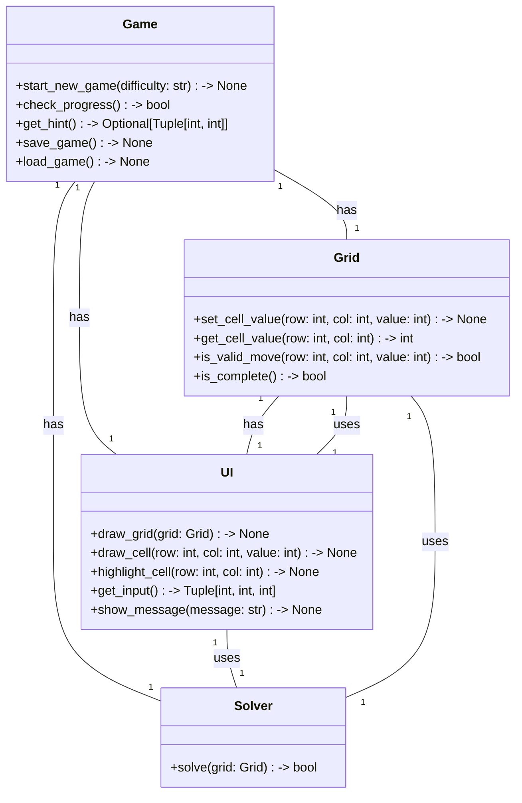
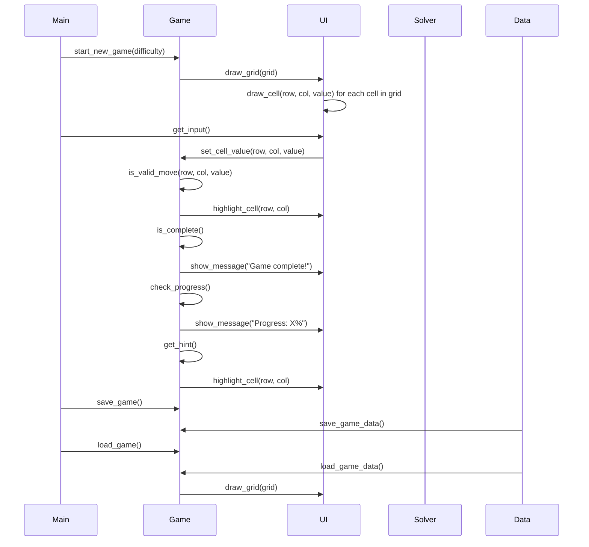

## Implementation approach:
For the implementation of the Sudoku game, we will use the following open-source tools:
- Pygame: A popular library for building interactive games and multimedia applications in Python.
- Pygame_gui: A GUI library for Pygame that provides a set of user interface elements and tools for creating graphical user interfaces.
- Numpy: A library for the Python programming language, adding support for large, multi-dimensional arrays and matrices, along with a large collection of high-level mathematical functions to operate on these arrays.

## Python package name:
```python
"sudoku_game"
```

## File list:
```python
[
    "main.py",
    "game.py",
    "grid.py",
    "solver.py",
    "ui.py"
]
```

## Data structures and interface definitions:


## Program call flow:


## Anything UNCLEAR:
The requirements are clear to me.