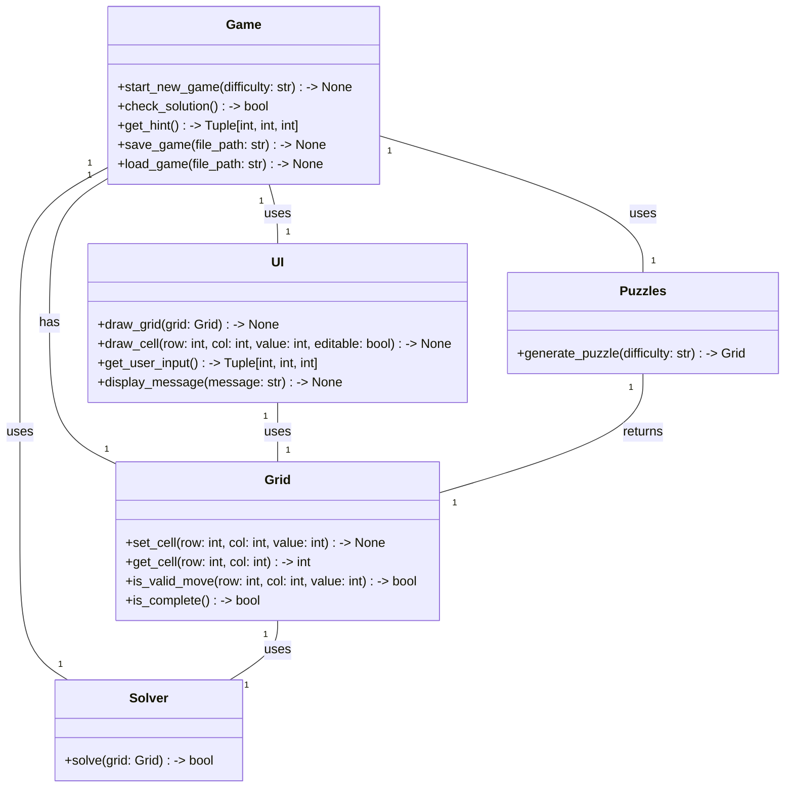
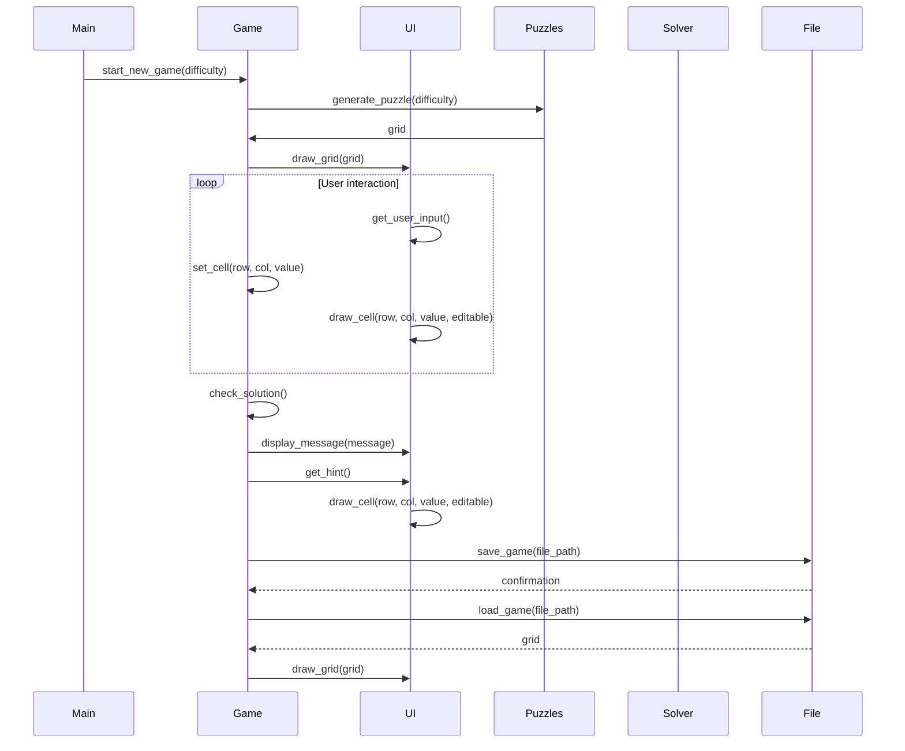

## Implementation approach:
For implementing the Sudoku game, we will use the pygame library, which is a popular open-source library for game development in Python. Pygame provides a simple and efficient way to create interactive games and multimedia applications.

To generate random Sudoku puzzles, we can use the sudoku library, which is an open-source Python library that provides functions for generating and solving Sudoku puzzles programmatically. This library will help us generate puzzles of varying difficulty levels for the game.

To create the user interface, we will use the pygame GUI toolkit, which is a set of modules that provide functionality for creating graphical user interfaces. It provides tools for drawing shapes, handling user input, and displaying text and images on the screen.

To save and load game progress, we can use the pickle module, which is a built-in Python module for serializing and deserializing Python objects. We can use this module to save the current state of the game to a file and load it back later.

## Python package name:
```python
"sudoku_game"
```

## File list:
```python
[
    "main.py",
    "game.py",
    "grid.py",
    "solver.py",
    "ui.py",
    "puzzles.py"
]
```

## Data structures and interface definitions:


## Program call flow:


## Anything UNCLEAR:
The requirements are clear to me.